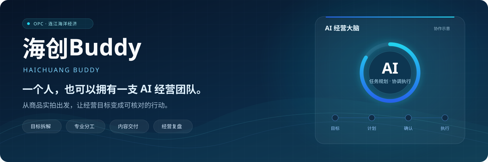
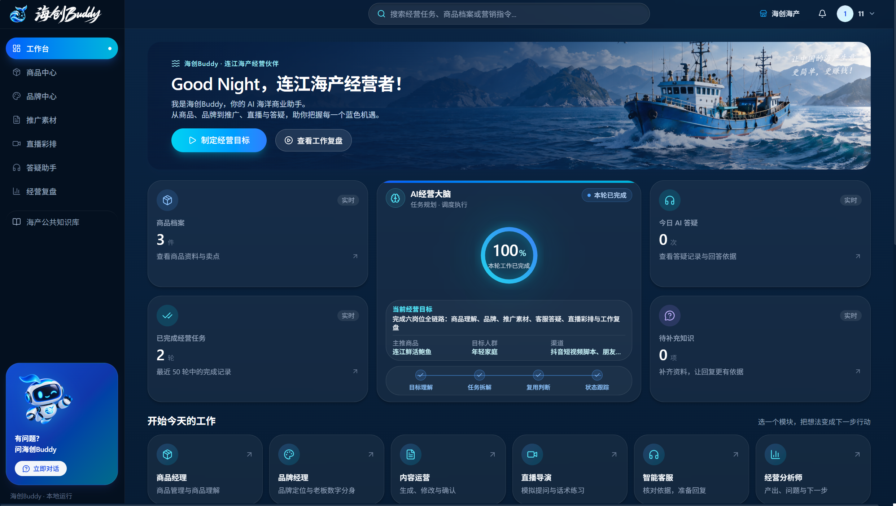
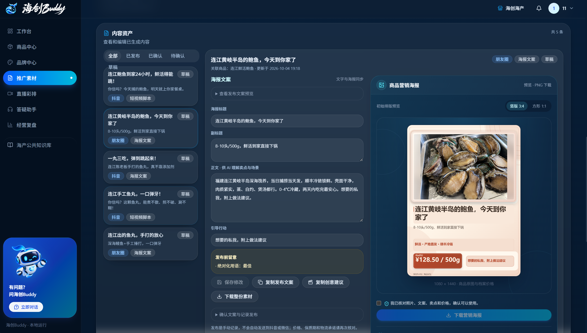
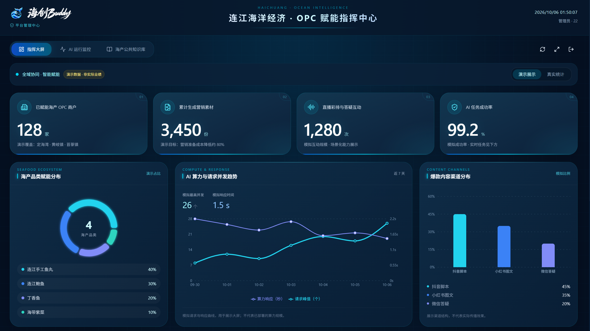
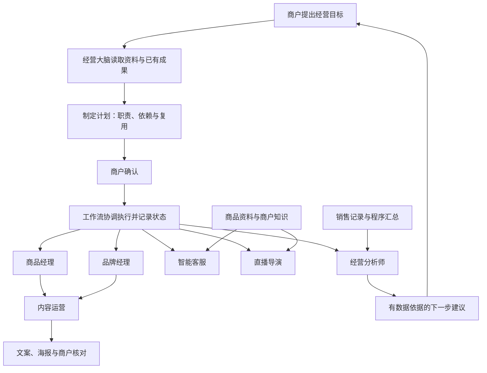

<div align="center">



# 海创Buddy · Haichuang Buddy

### 一个人，也可以拥有一支 AI 经营团队。

面向海产小商户与 OPC 个体经营者的 AI 经营工作台。<br />
用一个经营目标，连接商品、品牌、推广、答疑、直播准备与销售复盘。

[](https://github.com/yy9659/haichuang-buddy/actions/workflows/ci.yml) [](LICENSE)    

[界面预览](#界面预览) · [核心功能](#核心功能) · [快速启动](#快速启动) · [部署指南](docs/DEPLOYMENT.md) · [技术架构](#技术架构) · [参与贡献](CONTRIBUTING.md)

</div>

---

## 项目介绍

一家海产小店的经营者，往往要同时介绍商品、制作推广、回复顾客、准备直播和记录销售。海创Buddy把这些工作连接到同一个经营目标：经营大脑读取商户资料与已有成果，制定计划；商户确认后，工作流按依赖协调六类专业 Agent，记录过程并保存结果。

**一张产品图，跑通一场生意。** 从商品照片与已核对的价格、规格出发，生成推广内容、制作可下载海报、准备有来源的答复，再结合销售记录安排下一步行动。

当前项目处于应用原型阶段，已提供可运行的商户端与管理端，支持本地持久化和远程 PostgreSQL。AI 输出由商户核对，真实发布与经营决策由商户完成。

## 界面预览

### 商户工作台

经营大脑、当前目标、步骤进度与六个岗位入口集中展示，支持检索商品、素材和历史任务。



<details>
<summary><strong>查看营销海报工作区</strong> · 文案编辑、设计预览与 PNG 下载</summary>



海报保留商品实拍与档案价格。初始排版、AI 设计和可选的 AI 创意背景各有明确入口；下载前由商户核对。

</details>

<details>
<summary><strong>查看平台管理端</strong> · 指挥大屏、运行监控与公共知识管理</summary>



这张截图选择了“演示展示”：128 家、3,450 份、1,280 次及图表比例属于示例数据。管理端可切换到平台实际记录；示例数字不代表实际用户规模或经营成果。

</details>

## 核心功能

### 一个经营大脑，六类专业岗位

| 岗位 | 主要能力 | 页面 |
| :--- | :--- | :--- |
| **商品经理** | 管理图片、价格、规格与库存；生成商品理解、卖点、人群与使用场景 | `/products` |
| **品牌经理** | 整理店铺定位与店主表达偏好，生成可编辑、可确认的品牌档案 | `/brand` |
| **内容运营** | 按渠道与形式生成文案、分镜、口播或图文建议；设计并下载营销海报 | `/content` |
| **智能客服** | 模拟顾客提问，检索商户知识并展示来源；记录资料不足与人工确认需求 | `/customer-service` |
| **直播导演** | 模拟观众问题、提供回答建议，保存练习口播并生成文字评分与改进建议 | `/live` |
| **经营分析师** | 汇总销售、商品与渠道表现，生成附数据依据的 AI 建议与下一步入口 | `/analytics` |

工作台使用岗位名称，侧栏使用业务模块名称，两者指向同一页面。

### 从资料到可用结果

- **目标规划与执行**：商户确认计划后执行，支持依赖检查、成果复用、步骤跟踪、历史任务与失败重试。
- **营销海报**：文案驱动设计，支持一句话调整、竖版与方形 PNG 下载；通义万相可按需生成创意背景，商品照片保持实拍。
- **知识答疑**：知识切片、向量检索、回答引用与来源摘录；资料不足时提示人工确认并记录待补知识。
- **直播准备**：浏览器摄像头预览、语音转写或手工口播输入，按保存的文字生成练习反馈。
- **销售记录与建议**：记一笔销售、粘贴表格、导入 Excel/CSV，支持列映射、预览核对与明细编辑；销售变化后提示更新旧建议。
- **平台管理**：管理员身份分流、任务成功与失败监控、耗时与脱敏错误摘要、公共知识资料的核验与发布。

### 协作流程



各 Agent 可以共用同一底层模型，区别在于职责、提示词、输入输出契约与执行流程。实际岗位和步骤随经营目标与资料状态变化。商品事实来自商户档案，销售金额由程序计算，模型负责理解、生成与解释。

## 快速启动

### 环境要求

- **Node.js 24**
- **pnpm 12.6.0**，版本已在 `package.json` 声明
- 首次体验不需要单独安装 PostgreSQL，也不需要模型密钥

```bash
git clone https://github.com/yy9659/haichuang-buddy.git
cd haichuang-buddy
pnpm install --frozen-lockfile
```

尚未安装 pnpm 时，运行 `npm install -g pnpm@12.6.0`。

### 创建配置

Windows PowerShell：

```powershell
if (!(Test-Path .env.local)) { Copy-Item .env.example .env.local }
```

macOS / Linux：

```bash
if [ ! -f .env.local ]; then
  cp .env.example .env.local
fi
```

在 `.env.local` 中设置：

```dotenv
DATA_SOURCE=local
AI_PROVIDER=mock
```

```bash
pnpm dev
```

打开 **[http://localhost:3000](http://localhost:3000)**，注册并登录。全新本地数据库会自动建表；随后填写店铺、商品与品牌资料。下次只需执行 `pnpm dev`，按 `Ctrl+C` 停止。

`local` 模式默认把业务记录保存在 `.data/pgdata`，商品照片保存在 `.data/product-images`。`mock` 模型模式无需联网，新生成内容会带演示标记。常规启动无需执行种子或数据库重置命令。

### 接入真实 AI

修改 `.env.local` 并重启服务：

```dotenv
AI_PROVIDER=dashscope
DASHSCOPE_API_KEY=your-dashscope-api-key
```

已接入阿里云百炼 / 通义千问的文本、图像理解与向量化能力。可选通义万相用于海报创意背景；具体模型、接口地域与超时配置见 [环境模板](.env.example) 和 [技术与使用指南](docs/技术与使用指南.md#ai-模型)。真实调用需要有效密钥、相应模型权限、额度与服务端网络。

| 配置 | 可用选项 | 作用 |
| :--- | :--- | :--- |
| `DATA_SOURCE` | `mock` / `local` / `db` | 内存示例、本地 PGlite 或远程 PostgreSQL |
| `AI_PROVIDER` | `mock` / `dashscope` | 确定性示例或真实通义千问输出 |

这两组配置相互独立。其他模型提供方名称目前仅预留，尚未实现，调用会明确提示。

### 管理员入口

先注册账号，然后配置白名单并重启：

```dotenv
ADMIN_EMAILS=your-admin@example.com
```

管理员登录进入 `/admin`。多个邮箱以逗号分隔；页面和服务端操作均校验管理员权限。

## 部署

项目支持 **Node.js 服务部署**，使用 Next.js 服务端接口、数据库和文件存储。

```bash
pnpm install --frozen-lockfile
pnpm build
pnpm start
```

部署方式、环境配置、HTTPS 反向代理、远程数据库迁移以及持久化目录说明见 **[部署指南](docs/DEPLOYMENT.md)**。

- 单机体验：`DATA_SOURCE=local`，一个应用实例连接一个本地数据库目录。
- 长期部署：可选择远程 PostgreSQL 与 Supabase Storage；AI 背景目录仍需要持久化存储。
- 当前实现不适合静态网页托管；使用临时文件系统的平台前需调整文件存储与任务执行方式。

## 技术架构

| 层级 | 技术 |
| :--- | :--- |
| 全栈框架 | Next.js 16 App Router、React 19、TypeScript |
| 界面 | Tailwind CSS 4、Radix UI、Lucide、Recharts、Motion |
| AI 与校验 | DashScope 通义千问、可选通义万相、Zod 结构化输出 |
| 编排与检索 | 经营目标规划、工作流依赖与复用、失败重试、知识切片与向量检索、引用校验 |
| 数据与存储 | Drizzle ORM、PGlite / PostgreSQL、本地文件 / Supabase Storage |
| 开发与检查 | pnpm、ESLint、Vitest、GitHub Actions |

```text
src/
├── app/             商户端、管理端、认证页面与 Route Handlers
├── components/      业务组件与共享 UI
├── actions/         Server Actions：输入校验与服务调用
├── services/        业务编排与权限边界
├── ai/
│   ├── agents/      经营大脑与专业岗位 Agent
│   ├── prompts/     分岗位提示词
│   ├── schemas/     Zod 输出契约
│   ├── workflows/   依赖、复用、执行与重试
│   └── provider/    Mock、DashScope 与万相适配
├── rag/             知识切片、检索、引用与缺口
├── repositories/    数据访问接口与实现
├── db/              Schema、迁移与数据库网关
├── storage/         商品图片与创意背景存储
└── analytics/       指标计算与销售分析依据
docs/                功能、部署与资源说明
scripts/             种子、验证与开发维护工具
```

调用链：**页面 → Server Action / Route Handler → Service → Agent / Repository → 数据库**。模型密钥与数据库连接保留在服务端。

## 开发与贡献

```bash
pnpm typecheck
pnpm lint
pnpm test
pnpm build
```

GitHub Actions 在主分支提交与 Pull Request 时执行上述检查，使用 Mock 模式，无需仓库配置真实模型密钥。

数据库集成测试、独立测试目录与维护工具用法见 [贡献指南](CONTRIBUTING.md)。问题、改进建议和 Pull Request 欢迎提交到 [GitHub Issues](https://github.com/yy9659/haichuang-buddy/issues) 与 [Pull Requests](https://github.com/yy9659/haichuang-buddy/pulls)。

## 项目文档

| 文档 | 内容 |
| :--- | :--- |
| [技术与使用指南](docs/技术与使用指南.md) | 页面能力、海报、销售、模型配置、管理端口径与故障排查 |
| [部署指南](docs/DEPLOYMENT.md) | 本地生产运行、服务器部署、数据持久化、迁移与备份 |
| [贡献指南](CONTRIBUTING.md) | 开发流程、目录边界、检查与独立数据库测试 |
| [资源说明](docs/ASSETS.md) | 品牌文件、真实截图与替换方式 |
| [环境变量模板](.env.example) | 配置项与默认模型；真实密钥填写在本地配置 |
| [MIT 许可证](LICENSE) | 使用、修改与分发项目代码的许可条款 |

## 当前边界与后续方向

| 当前能力边界 | 后续方向 |
| :--- | :--- |
| 销售来自记账、粘贴或导入 | 对接获得授权的订单与销售系统 |
| 客服与直播使用站内模拟 | 对接真实消息与评论，完善人工接管 |
| 公共资料可查阅，未自动进入私有检索 | 资料订阅、索引与来源版本管理 |
| 彩排评分读取口播文字，摄像头为本地预览 | 更丰富的练习反馈与明确的数据授权 |
| 尚无实际增收、转化或节省成本的验证 | 真实商户试用与使用效果评估 |

## 许可证

项目原创代码采用 **[MIT License](LICENSE)**，允许使用、修改和分发，包括商业用途，须保留版权与许可证声明。第三方依赖遵循各自许可证；品牌与图像资源说明见 [ASSETS](docs/ASSETS.md)。

---

<div align="center">

**海创Buddy · 让一个人的经营，有团队的分工。**

[报告问题](https://github.com/yy9659/haichuang-buddy/issues) · [参与贡献](CONTRIBUTING.md) · [开始部署](docs/DEPLOYMENT.md)

</div>
