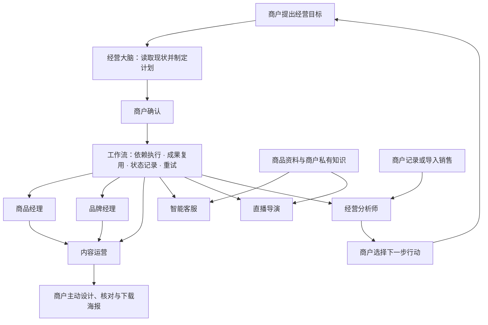

<div align="center">


# 海创Buddy · Haichuang Buddy

### 一个人，也可以拥有一支 AI 经营团队。

**面向连江海产 OPC 商户的 AI 经营工作台**

从商品实拍与档案出发，组织推广、答疑、直播准备和经营复盘。


[核心能力](#核心能力) · [协作流程](#协作流程) · [快速启动](#快速启动) · [参赛演示](#参赛演示) · [技术架构](#技术架构) · [项目文档](#项目文档)

</div>

---

## 为什么做这个作品

一家海产小店，经营者往往要同时介绍商品、制作推广、回复顾客、准备直播和记录销售。商品资料、文案、顾客问题与经营记录分散在不同环节，重复整理耗时，也容易出现信息不一致。

**海创Buddy把这些工作放进同一个经营目标中。** 经营大脑读取商户资料和已有成果，制定任务计划；商户确认后，工作流按依赖协调六类专业 Agent。每个岗位有对应的职责、输入和输出，商户能查看执行状态、复用成果、修改内容，并据销售记录决定下一步。

> **一张产品图，跑通一场生意。**
>
> 本作品以商品实拍、已核对的档案和商户确认作为起点，演示一轮经营准备与复盘。

作品通过 AI 辅助编程（Vibe Coding）开发，围绕 **OPC 超级个体** 与 **连江海洋经济** 场景参加福州理工学院“移动杯·Work Buddy”AI创新大赛应用赛道。

## 核心能力

### 一个经营大脑，六类专业岗位

| 岗位 | 给商户做什么 | 页面 |
| :--- | :--- | :--- |
| **商品经理** | 管理商品图片、价格、规格与库存；分析商品，整理卖点、人群和使用场景 | [商品中心](src/app/(app)/products/) |
| **品牌经理** | 整理店铺定位、店主表达偏好，生成可编辑、可确认的品牌档案 | [品牌中心](src/app/(app)/brand/) |
| **内容运营** | 按商品、品牌、渠道和形式生成文案；提供适配的分镜、口播或图文建议；设计并下载营销海报 | [推广素材](src/app/(app)/content/) |
| **智能客服** | 模拟顾客提问，检索商户知识、展示回答来源；记录资料不足与人工确认需求 | [答疑助手](src/app/(app)/customer-service/) |
| **直播导演** | 模拟观众问题、提供回答建议，练习口播并按保存的文字生成复盘评分 | [直播彩排](src/app/(app)/live/) |
| **经营分析师** | 记录与导入销售，汇总商品和渠道表现；给出附数据依据的 AI 建议与下一步入口 | [经营复盘](src/app/(app)/analytics/) |

工作台使用岗位名称，部分侧栏使用业务模块名称，两者指向同一页面。

### 值得看清的四个成果

| 可交付的营销海报 | 可核对的知识答疑 |
| :--- | :--- |
| **文案 → AI设计 → 商户核对 → PNG下载**。保留商品实拍与档案价格，支持一句话调整设计、竖版与方形尺寸，以及可选的通义万相创意背景。 | **问题 → 知识检索 → 回答与来源**。展开来源可查看文档与摘录；依据不足时提示人工确认，形成待补知识。 |
| **开播前的口播练习** | **销售记录带来的下一步** |
| **观众问题 → 导演建议 → 保存口播 → 文字评分**。本地摄像头预览、浏览器语音转写或直接输入，结束后查看改进建议。 | **记账/导入 → 程序汇总 → AI解读 → 商户行动**。建议能展开数据依据，销售修改后会提示更新旧建议。 |

### 工作台与平台管理

- **商户工作台**：经营目标、真实步骤进度、历史任务、失败重试，以及商品、素材和任务的顶部搜索。
- **销售记录**：随手记一笔、粘贴表格、导入 Excel/CSV；列映射与预览核对、明细编辑、独立演示记录、历史经营回顾及下载。
- **平台管理端**：管理员身份分流，指挥大屏、AI任务监控、公共知识资料的来源、核验、发布与归档管理。
- **运行记录**：追踪任务成功、失败、耗时与脱敏错误摘要；演示统计和平台实际记录分别标注。

## 协作流程



**规划和执行分开。** 经营大脑先生成计划，商户确认后才执行。实际岗位和步骤取决于目标、依赖与已有资料；各 Agent 可以共用同一底层模型。海报设计和销售录入保留明确的商户操作。

**事实和建议分开。** 商品事实来自商户档案；销售金额由程序计算；模型负责理解、生成与解释。回答引用、结构化输出和销售依据经过校验，模型失败会明确提示并保留已有成果。

## 快速启动

推荐使用 **Node.js 24** 与 **pnpm 12.6.0**（项目已声明 `packageManager`）。首次体验推荐本地 PGlite，免安装 PostgreSQL，重启后保留业务记录。

### 1. 获取代码并安装依赖

```bash
git clone https://github.com/yy9659/haichuang-buddy.git
cd haichuang-buddy
pnpm install --frozen-lockfile
```

尚未安装 pnpm 时可运行 `npm install -g pnpm@12.6.0`。

### 2. 创建本地配置

Windows PowerShell：

```powershell
if (!(Test-Path .env.local)) { Copy-Item .env.example .env.local }
```

macOS / Linux：

```bash
if [ ! -f .env.local ]; then
  cp .env.example .env.local
fi
```

编辑 `.env.local`，先用以下配置启动：

```dotenv
DATA_SOURCE=local
AI_PROVIDER=mock
```

`mock` 模型模式可体验界面与流程，新生成内容会带演示标记。全新本地库自动建表；注册后填写自己的店铺、商品与品牌资料。常规启动无需运行种子或重置命令。

### 3. 启动

```bash
pnpm dev
```

终端显示 `Ready` 后打开 **[localhost:3000](http://localhost:3000)**，注册并登录。下次启动只需进入项目目录执行 `pnpm dev`；按 `Ctrl+C` 停止服务。

### 4. 使用真实 AI

在 `.env.local` 修改以下两项并重启：

```dotenv
AI_PROVIDER=dashscope
DASHSCOPE_API_KEY=your-dashscope-api-key
```

真实模型接入 **阿里云百炼 / 通义千问**，包括文本生成、任务规划、商品图像理解和知识向量化。密钥留在服务端；具体模型、接口地域、超时及通义万相配置见 [环境模板](.env.example) 和 [技术与使用指南](docs/技术与使用指南.md)。网络、模型权限和额度需可用。

### 两组独立配置

| 配置 | 选项 | 控制什么 |
| :--- | :--- | :--- |
| `DATA_SOURCE` | `mock` / `local` / `db` | 业务数据：内存、本地 PGlite 或远程 PostgreSQL |
| `AI_PROVIDER` | `mock` / `dashscope` | 模型输出：确定性演示或真实通义千问 |

`DATA_SOURCE=mock` 重启还原；`local` 默认保存在 `.data/pgdata`。远程模式需配置 `DATABASE_URL` 并运行 `pnpm db:migrate`；商品图片使用 Supabase Storage。配置接受的其他模型提供方名称目前尚未实现，调用会明确报错。

### 管理端

先注册管理员账号，再在 `.env.local` 设置并重启：

```dotenv
ADMIN_EMAILS=your-admin@example.com
```

管理员登录进入 `/admin`，只显示平台管理界面。多个邮箱用逗号分隔；普通商户无法访问管理页面，相关操作由服务端重新校验权限。

## 技术架构

| 层次 | 使用技术与职责 |
| :--- | :--- |
| 页面与交互 | Next.js 16 App Router、React 19、TypeScript |
| 视觉 | Tailwind CSS 4、Radix/shadcn风格组件、Lucide、Recharts；深海主题与玻璃质感 |
| AI | DashScope通义千问、可选通义万相；分岗位提示词与Zod结构化输出 |
| 编排与检索 | 目标规划、任务依赖与复用、失败重试、知识切片与向量检索、引用校验 |
| 数据与图片 | Drizzle ORM；PGlite / PostgreSQL；本地文件或Supabase Storage |
| 质量检查 | TypeScript、ESLint、Vitest、数据库仓储集成测试、GitHub Actions |

```text
src/
├── app/             商户、管理与认证页面；Route Handlers
├── components/      业务组件与共享UI
├── actions/         Server Actions：输入校验与服务调用
├── services/        业务编排与权限边界
├── ai/
│   ├── agents/      经营大脑与六岗位Agent
│   ├── prompts/     分岗位提示词
│   ├── schemas/     Zod输出契约
│   ├── workflows/   依赖、复用、执行与重试
│   └── provider/    Mock、DashScope与万相适配
├── rag/             切片、检索、引用与知识缺口
├── repositories/    数据访问接口与各数据源实现
├── db/              Schema、迁移与数据库网关
├── storage/         商品图片与创意背景存储
└── analytics/       指标计算与销售分析依据
docs/                使用指南、参赛脚本与展示素材
scripts/             种子、验证与演示维护脚本
```

调用链：**页面 → Server Action / Route Handler → Service → Agent / Repository → 数据库**。模型凭据和数据库连接保留在服务端。

## 开发与检查

```bash
pnpm typecheck
pnpm lint
pnpm test
pnpm build
```

生产构建完成后使用 `pnpm start`。GitHub Actions对主分支提交及PR执行类型、Lint、单元测试与构建检查；自动检查使用Mock模式。

<details>
<summary><strong>数据库测试与维护命令</strong></summary>

| 命令 | 用途 |
| :--- | :--- |
| `pnpm test:db` | PGlite仓储集成测试；使用独立测试目录 |
| `pnpm db:generate` / `pnpm db:check` | 生成 / 检查Drizzle迁移 |
| `pnpm db:migrate` | 迁移远程PostgreSQL；本地启动自动迁移 |
| `pnpm db:studio` | 数据库管理界面 |
| `pnpm db:seed` | 写入或更新演示种子，适用于专门的演示数据环境 |
| `pnpm demo:reset` | 重建指定本地演示库，会清除该目录的数据 |

数据库测试前核对 `LOCAL_DB_DIR` 使用独立目录，避免指向正在使用的演示库。维护和重置前先停止服务并备份。正常启动与参赛录制都不需要重置现有数据库。

</details>

## 项目文档

| 文档 | 内容 |
| :--- | :--- |
| [技术与使用指南](docs/技术与使用指南.md) | 全部页面能力、海报操作、销售录入、模型配置、管理端口径与故障排查 |
| [环境变量模板](.env.example) | 所有配置与默认模型；真实密钥填入未提交的`.env.local` |

## 当前边界与后续方向

当前是可运行、可演示的应用原型。推广文案、回答和经营建议由商户核对；实际发布与经营决策由商户完成。

| 当前边界 | 后续方向 |
| :--- | :--- |
| 销售来自记账、粘贴或导入 | 在获得授权后接入商户订单与销售系统 |
| 客服与直播使用站内模拟 | 接入真实平台消息与评论，并完善人工接管 |
| 公共资料可查阅，尚未自动进入私有检索 | 增加资料订阅、索引与来源版本管理 |
| 评分读取口播文字，摄像头仅本地预览 | 增强练习反馈，并明确用户授权与数据处理范围 |
| 尚无实际经营增收与节省成本的验证 | 通过真实商户试用，评估内容使用率、准备时间与建议效果 |

`.env.local`、业务数据库、上传文件、包缓存和工具记忆均不作为公开仓库内容。备份本地业务记录时，同时保留数据库、商品图片和海报背景目录。

---

<div align="center">

**海创Buddy · 让一个人的经营，有团队的分工。**

问题与建议欢迎通过 [GitHub Issues](https://github.com/yy9659/haichuang-buddy/issues) 提交。

</div>

本仓库目前未指定开源许可证。
